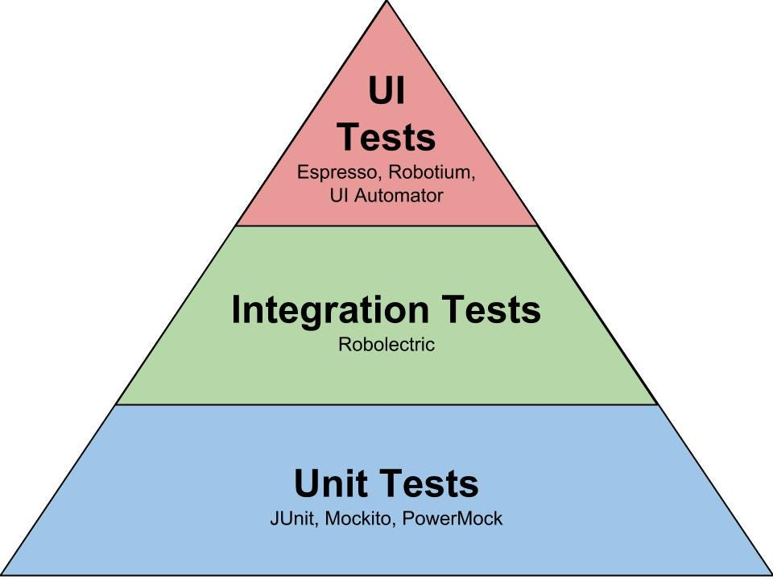

### Product Service Inventory Fetch using FakeStore Document 

------------

The Design of service goes as per the latest spring MVC pattern 

- models : All the table related info
- controllers : first point of contact for client 
- dtos : interacting with databases
- configs : storing any custom class configs 
- services : handling business logic 

-----

#### Product Service Implementation

- Its been implemented using **REST** based template
- Utilizing the [FakeStore](https://fakestoreapi.com/docs) doc data
- DTO's -> is the contract between 2 services, when we want to get the response, create a DTO

#### Class level details 

- Services : ProductService 
  - ProductService interface has method `` getAllProducts()`` whose impl is done using ``FakeStoreProductDto`` array instead of List
  - If we use, response type of dto as `List<FakeStoreProductDto>.class` its gives error _cannot access object of parameterized type_.
  - if we use directly, `List.class`,
  - List by default at runtime, isn't aware of custom object, at runtime it compiles with top level iterator ``Object``, concept known as **Type Eraser**
  - **Type Eraser** was introduced to have back word compatible before Java5 
  - Therefore, advised to use array as we can set custom type during compile time itself, because with List deserialization is not possible at runtime.
  - JSON array, is not same as List<> of array.


- Controller : 
  - `replaceProduct(Long id, Product product)` 
    - By default, `restTemplate` is implemented the `PUT` call to return `void`, but we have to return a updated product response to users,
      - There are 2 ways to perform this, 
        - one is call the `getProductById(id)`, then on the same id, call the update & once its updated, then make a get call again to return the updated product details to users. 2-3 network calls, high latency
        - Implement the custom `PUT` call to return updated product details. 
    ```java
          RequestCallback requestCallback =
                  restTemplate.httpEntityCallback( fakeStoreProductDto, FakeStoreProductDto.class);

          ResponseExtractor<ResponseEntity<FakeStoreProductDto>> responseExtractor =
                  restTemplate.responseEntityExtractor(FakeStoreProductDto.class);

          FakeStoreProductDto fakeStoreProductDto1 = restTemplate
                  .execute("https://fakestoreapi.com/products/" + id,
                          HttpMethod.PUT, requestCallback, responseExtractor)
                  .getBody();
      ```
- `getProductById(id)`
  - In order to handle the exception, for Product Not found, the below `ResponseEntity<>` returns compile time error 
  - error : `Requried String, Provided ResponseEntity<Product>`, therefore we have to create a exceptional handler 
  - ```java
    try{
        product = productService.getProductById(id);
        productResponseEntity = new ResponseEntity<>(product, HttpStatus.OK);
      }catch (InstanceNotFoundException exception){
            productResponseEntiry = new ResponseEntity<>("Product Not found with id " + id, HttpStatus.NOT_FOUND); -> error
      }
    ```
  - We can fix this, by adding `@ExceptionHandler(CustomException.class)` at controller level & at service level we can add
  - ```java
    if( fakeStoreProductDto == null ){
    //productResponseEntity = new ResponseEntity<Product>("Product Not found", HttpStatus.NOT_FOUND);
     throw new InstanceNotFoundException("Product Not Found with id" + id);
    }
    ```
    - On throwing the custom exception, we have add a filter to handle any exception, `@ExceptionHanlder(customException.class)` is used to handle it.
      - ```java
        @GetMapping("/{id}")
        public ResponseEntity<Product> getProductById(@PathVariable("id") Long id) throws ProductNotFoundException {
          Product product = productService.getProductById(id);
          ResponseEntity<Product> productResponseEntity = new ResponseEntity<>(product, HttpStatus.OK);
          return productResponseEntity;
        }
        ```
      - If we want to return custom error code & messages, then we can create a DTO, that gets triggered by `ProductNotFoundException.class`
      - ```java
         @org.springframework.web.bind.annotation.ExceptionHandler(ProductNotFoundException.class)
          public class ProductNotFoundExceptionDto {
            Long errorCode;
            String message;
        }
      ```
  - Therefore, the response of custom Exception handler is as below
  - ```json
    {
      "errorCode": 100,
      "message": "Product Not Found with id21"
    }
   ```

- In order to handle exceptions in better way, spring have `@ControllerAdvice` annotation, which acts as filter between client - controller
- `@ControllerAdvice` does final check on whatever being returned by controller, its at global level.

## 3rd party api nuances and Response Entity

- Steps required when application connects with database 
  - create a connection 
  - define the schema ( tables & cardinalities )
  - perform crud operations
  - Example : 
  ```java 
  createProduct(Product prod){
     Database db = new Database(URL, userName, password);
     db.connect();
     Query q = Insert Into Products value( );
     db.execute(q);
  }```
- For defining the schema design, the closest things that connects to schema in application are models.
- This are done using ORM( Object RelationShip Mapping ), it provides a ways to create tables based on objects & relationships
- Benefits of ORM 
  - Automatically creates corresponding tables for models 
  - Automatically help us to perform CRUD operations
  - Example : 
  ``` java
    productRepo.findById(id);
  ```
  - This line converts into 
  ```SQL 
    Select * FROM Products WHERE id = id
  ```
  
### ORM Framework - Hibernate, MyBase 
- At the core, there is central authority that defines how perform/define that object relationship mapping, that authority is JPA( Java Persistent API )
- Application ( Services ) connects with <<JPA>> Interface which internally connects with ORM framework such as Hibernate, MyBase
- Hibernate at core will connect to (Java Database Connectivity )JDBC interface, that helps to connect various databases such as MYSQL Driver, MongoDB Driver,  

### Repository Pattern 
> Where to write a code, that will interact with database ? should we club with business logic ( service layer ) ? No

- Code that connects with db, should be present in different layer : Repository Layer 
- Example : 
   ``` java 
   public interface ProductRepo extends JPARepository<Product, Long>{}```
- here, `JPARepository<T, ID>` takes in the generic Type of class & the primary Key of that class
> NOTE : If UUID is completely random, then there will be issues with indexing. 
For that, in order to maintain auto increment, along with Random property. For that, we can use timestamp.  to maintain the increasing order

### Repositories, UUIDs, Representing Inheritance
- How to represent Inheritance in DB, There are 4 ways are representing 
1. **MappedSuperClass**
  - Base/parent class is Abstract, i.e no object of parent class & the inherited class to have base class property then we can use `@MappedSuperClass`
  - Properties
    - No Table for parent/base class
    - One table for each subtype with their own attributes as well as from parent.
  - Pros
    -> we can get details of child class easily .
  - cons
   -> the joins will be costly, between different child attributes.
- Example : @MappedSuperClass at the parent-class & @Entity at respective child classes, in this case joins will be costly, say use case is get email of all users
  - Query : ``` 
          SELECT email FROM Student UNION SELECT email FROM Mentor UNION SELECT email from Instructor
        ```
```java
@MappedSuperclass
public class User {
    @Id
    private Long id;
    private String name;
    private String email;
}

@Entity(name = "Mapped_super_Stud")
public class Student extends User{
    private String batch;
    private String course;
}

@Entity(name = "Mapped_super_Mentor")
public class Mentor extends User{

    private String company;
    private double avgRating;
}

@Entity(name = "Mapped_super_Instr")
public class Instructor extends User{

    private String specialization;
}
```
    
2. **Joined Table**
   - Here, we will create table for Parent class & every child will have table with there own attributes.
   - All the common attributes are stored in parent class. And create tables for each sub class with there own attributes
   - The parent <-> child relationship will be interms of Foreign Key.
   - Pros
     - In order to get all users, then just run -> Select email from users. 
   - cons
     - Joins based on the child attribute from all the child table is costly.
     - Duplicated data. Sync issues
     - The below query gets all the emails_ids, 
        - Query : ```
          SELECT email FROM User```
     - But if we want to get, `email of Mentor & Student` only then, `JOIN` is required.
   - Example 
   ```java
   @Entity(name = "user_joined")
    @Inheritance(strategy = InheritanceType.JOINED)
    public class User {
        @Id
        private Long id;
        private String name;
        private String email;
    }
    @Entity(name = "Mapped_super_Stud")
    public class Student extends User{
    private String batch;
    private String course;
    }
    
    @Entity(name = "Mapped_super_Mentor")
    public class Mentor extends User{
    
        private String company;
        private double avgRating;
    }
    
    @Entity(name = "Mapped_super_Instr")
    public class Instructor extends User{
    
        private String specialization;
    }
   ```
3. **Table Per Class**
 - Table per class. here we are creating table for both parent & child. 
 - Table for each class will have there own attributes & as well as parent attributes.
 - Example 
   - User - id, nam e, email, password 
   - Mentor - id, name, email, password, company, avgRating 
   - Instructor - id, name, email, password, specialization
 - Pros
   -> every query is fast enough 
 - Cons
   -> data duplicacy & will have sync issue
 - Example : 
```java
@Inheritance(strategy = InheritanceType.TABLE_PER_CLASS)
public class User {
    @Id
    private Long id;
    private String name;
    private String email;
}
@Entity(name = "single_stud")
public class Student extends User{
    private String batch;
    private String course;
}

@Entity(name = "single_mentor")
public class Mentor extends User{

    private String company;
    private double avgRating;
}

@Entity(name = "single_Instr")
public class Instructor extends User{

    private String specialization;
}
```


4. **Single Table**
 - Here, we are creating table with all attributes of child as well as parent in columns 
 - Add one extra col for user-type
 - Example 
   - Name, email , password, company, AvgRating, Specialization 
 - Cons
   - To many Nulls ( Sparse Table )
   - waste of space.
   - Example : @DiscriminatorValue(value = int), should be added at each child-classes with different value, this value helps to differentiate between the type of tables
```java
@Entity(name = "single_user")
@Inheritance(strategy = InheritanceType.SINGLE_TABLE)
public class User {
    @Id
    private Long id;
    private String name;
    private String email;
}

@Entity(name = "single_stud")
@DiscriminatorValue(value = "1")
public class Student extends User{
    private String batch;
    private String course;
}

@Entity(name = "single_mentor")
@DiscriminatorValue(value = "2")
public class Mentor extends User{

    private String company;
    private double avgRating;
}

@Entity(name = "single_Instr")
@DiscriminatorValue(value = "3")
public class Instructor extends User{

    private String specialization;
}
```

Summary,
1) MappedSuperClass - no table for parent, will make sure that all the parent attributes are inherited in the respective child class 

2) JoinedTable - table for parent & child classes & link via foreign key

3) Table Per class - create table for Parent class as well

4) SingleTable - All attributes in single table/class


## JPA Queries, Cardinality Mappings
- Query Methods - Declared Queries, HQL( Hibernate Query Language ), SQL
- Fetch Types - Eager, Lazy
- Schema Versioning

- Query Methods
  - Declared Queries : Queries provided by JPA
    - Example : findById(Id)
    - No need to write queries by our own, just write the method name, the ORM will convert that method name into corresponding query
    - The issue araises, if we want to show specific details to user, say product contains details such as _sales_no_, or _merchant_id_, by default
    `JPA` will show all the product details, therefore, in order have specific details to be shown to user/client we can use `HQL` or `SQL`
- HQL 
  - We can create the HQL query with **@Query** annotation, by default it will try to project the query into return type.
  - In `HQL`, for below query, `Product` will be object(JAVA object)
  - Say for example : 
  ```java 
     @Query("SELECT p.title AS title, p.description as description FROM Product p WHERE p.id = :id")
     Product getProductByTitleAndDesc(@Param("id") Long id);
  ```
  - Here, ll get Error :  No converter found capable of converting from type [java.lang.String] to type [com.productservice.models.Product]
  - For resolving this we need to create Projections, a interface that only consists of getTitle(),  getDescription() method
  > Projections are suppose to be created when we have the requirement of getting partial data from Table/database
  ```java
    @Query("SELECT p.title AS title, p.description as description FROM Product p WHERE p.id = :id")
    ProductTitleAndDescribtion getProductByTitleAndDesc(@Param("id") Long id);
  ```
  - Here, the `ProductTitleAndDescribtion` is just an interface defined in projections package. 
  
  ```java
      public interface ProductTitleAndDescribtion { 
          String getTitle();
          String getDescription();
      }
    ```
  - We can test it in `SelfProductService.java` file, 
  ```java
    @Override
    public Product getProductById(Long id) throws ProductNotFoundException {
        ProductTitleAndDescribtion productTitleAndDescribtion = productRepo.getProductByTitleAndDesc(id);
        System.out.println("Projections -> " + productTitleAndDescribtion.getTitle() + " " + productTitleAndDescribtion.getDescription());
        return productRepo.findById(id).get();
    }
    ```
- SQL 
  - we can define the SQL type of query similar to HQL, this SQL query doesn't gets converted to any object, Example
  ```java
    @Query(value = "SELECT title, description FROM Product WHERE id = :id", nativeQuery = true)
    ProductTitleAndDescribtion getProductByTitleAndDescSQL(@Param("id") Long id);
  ```

- Fetch Types
  - Eager : Fetch details of inner object (say List<Products> ), along with details of outer object. Everything is eagerly loaded except _Collections_
  - By default, _Collections_ are lazy loaded.
  - we can change the fetch-type as below
  - Specify the fetch type & on which type we need to `Join` that needs to be specified, using `@JoinColumn`
```java
@Entity
public class Category extends BaseProduct{

    private String description;
    @OneToMany(fetch = FetchType.EAGER)
    private List<Product> productList;
}

@Entity
public class Product extends BaseProduct{

    private String description;
    private  Double price;
    @ManyToOne
    @JoinColumn
    private Category category;

}
```
  - Since  by default, _Collections_ are lazy loaded, no need to specify the Fetch type for Collections
  - Lazy : Only fetch the details of outer objects, and fetch inner object when required.
```java
@Entity
public class Category extends BaseProduct{

    private String description;
    @OneToMany(fetch = FetchType.LAZY) //Not required
    private List<Product> productList;
}

@Entity
public class Product extends BaseProduct{

    private String description;
    private  Double price;
    @ManyToOne
    @JoinColumn
    private Category category;

}
```

------
## Representing cardinalities Schema Versioning & migrations, N + 1 query Problem
- We have defined the cardinalities above. 
- What if there is requirement, to include @OneToMany & @ManyToOne in both 1 : M & M : 1 classes, usually, we have either one of them, but in case if we want to include both of them. 
- In that case, 
```java
@Entity
public class Category extends BaseProduct{

    private String description;
    @OneToMany(mappedBy = "category") // @OneToMany(mappedBy = "foreign-key-variable")
    private List<Product> productList;
}

@Entity
public class Product extends BaseProduct{

    private String description;
    private  Double price;
    @ManyToOne
    @JoinColumn
    private Category category;

}

```
-------

## Testing : Unit Testing

Content 
- Why Testing 
- TDD ( Test driven development )
- Flaky Testing
- Types of testing
  - Unit 
  - Integration
  - Functional 

Why Testing 
- We shd write test cases that triggers automatically, before submitting the code & if the test fails then the code can't be merged

TDD ( Test driven development )
- Here, first write all the test case, before the feature is implemented.
- Time consuming 
- Figure out all the testcases & where the test case might get failed 

Flaky Testing
- These are tests, which sometimes fails & sometimes they succeds, example : Network tests
- These are inconsistent & shd be avoided as much as possible
- Example : Network tests, Randamazation, Concurrency

- Types of testing
  - Unit 
  - Integration
  - Functional 
- > Ideally, if there is a dependecy of services/object, the test case shouldn't be failing because of external dependecy. Therefore **we shd test in isolation**, these is achived using mocking.
- Example : `ProductController` is having a external dependency of `ProductService`, then we should mock `ProductService` within the same process of `ProductController`

Unit Testing
- Every individual piece of code shd be tested, Unit testing is very fast as it will be tested at function level. 
- No dependency on any other function, every dependency shd be mocked.
- Test coverage : min `80%`, `Jacaco` is one of the tool to check this coverage.

Integration Testing
- Testing, the flow within the project, testing each functionality of the software system, where all dependency will also be triggered as its present.
- Example : `ProductController` -> `ProductService` -> `FakeStoreAPI`
- This is ideally, if there are chagers for calling the 3rd party api's, partically we mock the 3rd party response & test.

Functional 
- User acceptance testing, testing the user journey, done on pre-prod / test env by QA's.
- The key difference between Integration testing Vs Functional testing 
- In integration testing, we test single functionality, where as in function testing we have different api calls/network calls. 

> Test Graph



## Testing Good practices, mocking & Types of Doubles

Content
- Best practices for unit testing
- Mocking 
  - Types of Doubles

> Unit Testing : Testing in isolation, edge cases, negative cases & happy case

#### Properties of Unit testing
- Fast, since testing small piece of code
- will follow, 3A's/3C's framework, 
  - Arrange/Create : create the input parameters required for testing
  - Act/Call : Run/trigger the function which needs to be tested
  - Assert/Check : check the response/excepted vs actual output
```java 
testAddition(){
    int a = 5; int b = 10; //Arrange
    Calculator cal = new Calculator(); 
    x = cal.add(a, b); //Act
    assert(x, 15); //Assert 
}
```
- Isolation : Success/failure of test should not depend on any of its dependencies, in order to achieve this we should hard code, 
the behaviours of all dependencies. we can achieve this via `mocking`

- Repeatable : Testcases should be able to run again & again for same input, testCase should not be flaky 
- Self-Checking : Every test case should be triggered automatically, there shouldn't be any human intervention.
- Test Behaviour, Not implementation : The functionality should be tested, not the implementation as impl changes frequently,
  - Example : expanding the LinkedIn network is a functionality, where as the internally implementation might be using some graph-algo, & that is later changed, 
  to some other graph-algo, Therefore, the testcase should test functionality not the implementation. 
  In simple terms, test cases shouldn't be concerned about the internal implementation.

#### Mocking

- Say, we have to write a testcase for `.getProductById()` which is present in `ProductController`, for which we have a dependency,
of `ProductService`, therefore, create a `Mock` of `ProductService`, as its an external dependency to `ProductController`.
- `Mock` 
  - > when productService.getProductById(--), then return MockedProduct
- To achieve mocking, we should use _Doubles_ 
- Doubles : Sample objects that is going to replace the actual object in testing -> Mocked Objects
- Types of Doubles
  - **Mock** : A double will return the value where ever it has handled, means it returns same value irrespective of any input passed
    - > eg : when productService.getProductById(1), then return product1
    - Here irrespective of any value passed, it always returns `product1` as output. No dynamism possible
    - Most commonly used double. 
  - **Stub** : Stub will try to replicate some behaviours of original class, means its able to adjust some behaviours
  - **Fake** : Temporary data store, where instead of triggering to database, we can replicate `FAKE` mock to use `MAP`/ `HASHMAP` to sotre
  the data similar to db. 
    - Fake is very close to reality.

----
#### Testing-3

- For creating the depednecy `mock`, we have `@MockBean`, with this spring injects the bean 


### Annotations
Spring supports various annotations, below are few of them

| Annotations                    | Defined Level         | Description                                                                                                                                                  |
|--------------------------------|-----------------------|--------------------------------------------------------------------------------------------------------------------------------------------------------------|
| @Controller                    | Class                 | informs the dispatcher servelet that this controller handles the incoming request at specified endpoint                                                      |
| @RequestMapping                | method                | helps in declaring the custom endpoint                                                                                                                       |
| @ResponseBody                  | method                | Informs dispatcher to return a method response as http response in web page                                                                                  |
| @RequestMapping                | method-parameter      | Handles to get the parameters from the view                                                                                                                  |
| @Service                       | Class                 | the business logic resides within the service layer                                                                                                          |
| @Autowired                     | variable              | the created bean can we used without creating object of bean with Autowired                                                                                  |
| @Primary                       | method/class          | If there are multiple @componentscan/@Service implementations, using @Primary tell spring to pick this one as primary bean to create                         |
| @Configuration                 | App Config            | Sets up the required configurations                                                                                                                          |
| @Qualifier(name="custom-name") | Constructor-parameter | Defined at injection (constructor injection)  parameter level, if there are multiple @Service implementations, @Qualifier will take precedence over @Primary |
| @OneToOne                      | variable              | Defines the cardinality of 1:1 mapping                                                                                                                       |
| @OneToMany                     | variable              | Defines the cardinality of 1 : M mapping, like Category : Product                                                                                            |
| @ManyToOne                     | variable              | Defines the cardinality of M : 1 mapping, like student : session                                                                                             |
| @ManyToMany                    | variable              | Defines the cardinality of M : M mapping                                                                                                                     |
| @JoinColumn                    | variable(Foreign key) | Specifies, on which List<> of entity should be joined                                                                                                        |
| @SpringBootTest                | Class                  | TestClass bean creation                                                                                                                                      |


---------
#### References 
- [Type Eraser](https://www.baeldung.com/java-type-erasure)
- [SQL Indexing](https://www.atlassian.com/data/sql/how-indexing-works)
- [Relationship in JPA](https://www.baeldung.com/hibernate-inheritance)
- [JPA Query Methods](https://docs.spring.io/spring-data/jpa/reference/jpa/query-methods.html)